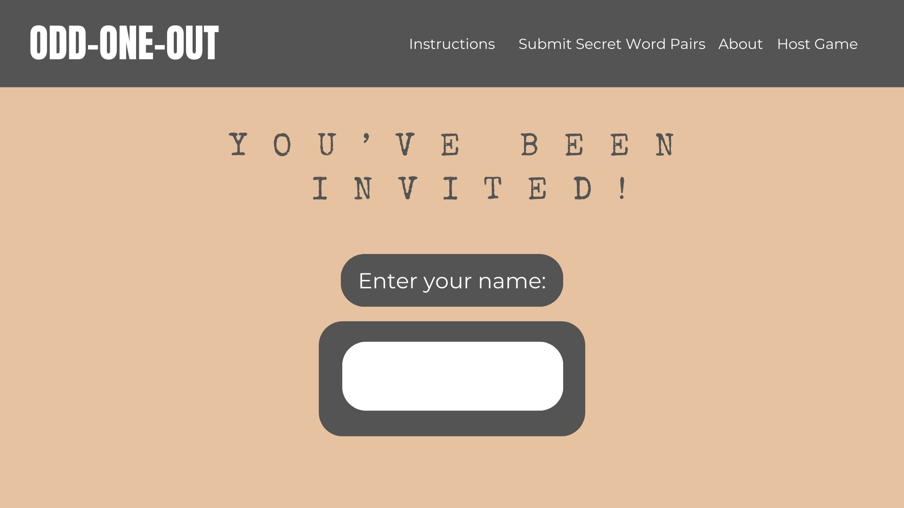

# CS_260

### Progress
- [x] Specification Deliverable
- [x] HTML Deliverable
- [x] CSS Deliverable
- [x] JavaScript Deliverable
- [x] Service Deliverable
- [x] Database/Login Deliverable
- [x] WebSocket Deliverable
- [x] React Deliverable

## Specification Deliverable

### **Elevator Pitch** 
Have you ever played a social game like Mafia or One Night Werewolf and been frustrated about having to download an app or designate someone as a host before you can play it? Have you ever wanted to play remotely or ensure that no one changes their votes last minute? The Odd-One-Out website provides a simple and easy-to-use interface that the whole family can enjoy. With a brand new perspective on traditional social games, players have to figure out what team they are on in the game based on other players' responses. Unlike other social games, Odd-One-Out will keep everyone guessing until the very end!

### **Game Rules**
The game begins when everyone receives the same "secret word" except the Odd-One-Out who receives a similar but slightly different word. Starting with a random player determined by the application, each player takes turns clockwise, describing their "secret word" with another word while trying to avoid giving away their identity as the potential Odd-One-Out. The other players must use their detective skills to figure out who has a different word and vote on who they think the Odd-One-Out is. If they vote the Odd-One-Out, the Odd-One-Out has one chance to guess what everyone else's word is. If the Odd-One-Out guesses the word correctly or if they are never voted out, they win. If not, everyone else wins. 

### **Design**
There are four main pages. The first displays the login where you enter your username.

  
  
  The second is the waiting room that the host creates and where players wait to start.
  
  
  
  The third is the page with the instructions that will detail how to play the game. This page can be checked in the middle of the game for reference.
  
  
  
  The last page is the game page that displays the Secret Word and the voting feature. 
  
  

### **Key Features**
The project will showcase the following features
- Ability to host and join game groups
- Outline of game instructions
- Distribution of "secret words"
- Moderate player guesses and reveal player teams

### **Technologies**
I will implement the following technologies:
- **HTML** - Four HTML pages for hosting a game, joining a game, and voting on the Odd-One-Out.
- **CSS** - Intuitive game display that fits well on mobile devices, featuring a game instructions tab, voting buttons, and a "secret word card". 
- **JavaScript** - Manages players' votes and creates game rooms.
- **Service** - Backend structure that helps in handling "secret word" choices, voting status, voting verdict, player status, and authentification.
- **Database** - Stores and retrieves "secret word" pairs and players' scores in a database.
- **WebSocket** - communicates players' votes and the voting verdict. 
- **React** - Utilizes the React framework for effective design and a professional display.

## HTML Deliverable
- **HTML** - Four HTML pages; the home page; the join game page; the waiting room page; and the gameroom page.
- **Links** - The Header tag links all four pages together as well as four other buttons that allow joining and hosting a game.
- **Text** - Overview and an About section for the game are listed on the home page as well as Instructions on the waiting room page. 
- **Images** - Spy images are included for each player's voting card as well as a spy icon on the tab for each page
- **Database** - Stores the user's name, votes, and secret words in a database. Also accepts submissions for secret word pairs.
- **WebSocket** - Will display the voting results as well as players' identities after the voting concludes.

 ## CSS Deliverable
- **Prerequisites** - Simon CSS deployed, link to GitHub in the footer, git commits spread throughout the assignment period and notes in README.md file completed
- **Organization** - Header, footer, and main content completed
- **Navigation** - Navigation through links in the header and the buttons on the page
- **Resizing** - Window and elements responsive to resizing
- **Images** - Includes images on the home page, character icons, and the spicon on the tab. 
- **Text** - Text content with imported fonts and detailed instructions on the game. 

## JavaScript Deliverable
- **Prerequisites** - Simon JavaScript deployed, link to GitHub in the footer, git commits spread throughout the assignment period and notes in README.md file completed.
- **Login** - Sign-in and Registration are implemented through the Sign-in button or in the header.
- **DataBase** - User information, as well as game state (voting, number of players) will be stored in the DataBase
- **WebSocket** - This will be very important later. For now, I just included 3 default players in the waiting room and the game room. Eventually, it will display everyone together in a session. 
- **Voting Logic** - In the game room you can click on players to vote them out. The player with the highest votes will be voted out, and the round will continue. When you select your own name, you are kicked out of the session.  
- **Local Storage** - Local storage is cleaned when you access the home page, and the Submit Secret Words button and the textboxes on the home page help determine the words that show up in the gameroom.

## Service Deliverable
- **Prerequisites** - All prerequisites completed.
- **Node.js and Express** - Node.js and Express HTTP service created to allow hosting on a server and backend/frontend design.
- **Express Static Middleware** - Used to serve up static HTML, CSS and JavaScript files to the frontend.
- **Third Party Endpoints** - WaitingRoom.HTML calls a third-party API to generate a QR code with the current URL so that people can join the game by scanning it.
- **Backend Endpoints** - Endpoints created for creating a game room, adding a player, getting a list of all players in the game instance, logging in, getting the final votes, getting the secret words, submitting a vote, generating the OddOneOut, and registering. Voting is no longer fully functional because you need Websocket to run through all players' votes, but the endpoint is prepped for that step.
- **Frontend Calls Endpoints** - All the endpoints are called from the frontend using the fetch function.

## Database Deliverable
- **Prerequisites** - All prerequisites completed.
- **MongoDB Atlas Database** - Uses a MongoDB Atlas Database for persistent storage. Temporary data such as player names, votes, and game states are not stored in the database because they should disappear when the game session ends. Game sessions will be stored in the database when the WebSocket Deliverable is implemented. 
- **Registration** - Registers new users and inserts username and password into the Users database. Passwords are hashed when stored in the database for increased protection. If the username already exists, then an alert pops up to notify the player. 
- **Logging In** - Previous users can log in and receive an auth token which is stored in a cookie on the browser. As long as you logged in, when you click on the Start Game button you will automatically skip the invitation.html page and go directly into a waiting room. 
- **Stores Credentials** - Stores users' credentials in the OddOneOut.Users collection, as well as their auth tokens and autogenerated _id's used in the database. 
- **Authentication Based Functionality** - Restricts application functionality by requiring login and authentication. An additional "log out" tab was added on the gameRoom.html and waitingRoom.html headers so that you can switch between users. When you log out, you are automatically redirected to the home page. 

## WebSocket Deliverable
- **Prerequisites** - All prerequisites completed.
- **Backend** - Creates WebSocket server in WebSocket.js and listens for a WebSocket connection.
- **Frontend** - Establishes a WebSocket connection in waitingRoom.html. That connection is associated with the other connections in each room through the game object on the server.
- **Data Sent over WebSocket** - When a player is added, or a vote is made, data is sent through the WebSocket's message handler to all other players in each game room.
- **Data Displayed on Application Interface** - When a player joins, their card appears on the screen with their name on it. When a verdict has been reached after voting, the chosen player is removed from the screen.

## React Deliverable
- **Prerequisites** - All prerequisites completed.
- **Vite** - Vite was used for a fast and efficient build toolchain.
- **React Components** - Home, Login, WaitingRoom, and GameRoom React components implemented to display the user interface.
- **React Router** - React Router included to navigate from the Home component to the Login or WaitingRoom components.
- **React Hooks** - useState implemented to track and display current players in the game, as well as track various other variables. useEffect implemented to limit the setting of variables whenever the DOM is re-rendered.

<!-- 
The game is called odd one out or something
everyone gets a word and one person gets a slightly different word (the odd one out). starting with one random player, everyone says a word that indirectly points to their shared word. after everyone says one word to show they have the same word, they guess on one person to eliminate who they think is the odd one out. if they guess correctly, the odd one out has one chance to guess the correct word. If they guess correctly, they win. if they guess incorrectly everyone else wins. if they guess someone who isnt the odd one out, then that last person is eliminated from the game. the odd one out does not know that they are the odd one out. 

--!>
